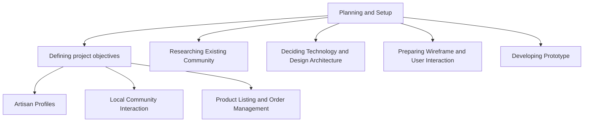
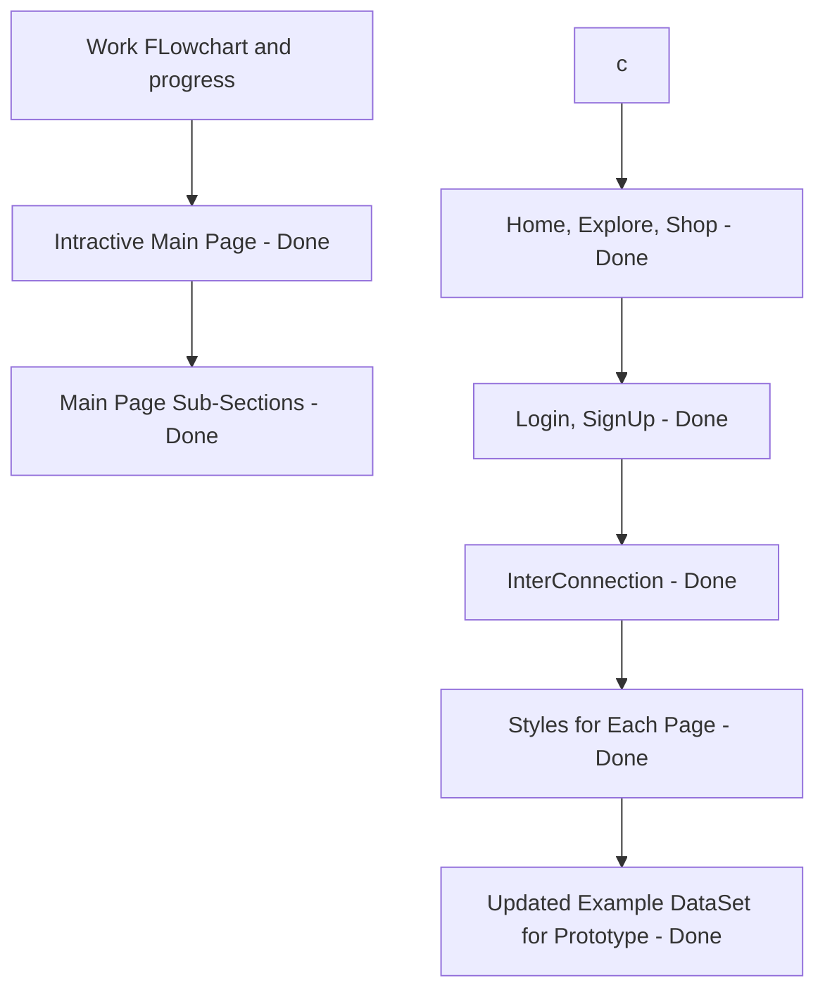

# CN182-Hactivate

# WD201 Online Marketplace for Local Artisans
## Statement
In today's digital age, local artisans often struggle to reach a wider audience for their unique handmade products. This project aims to develop a full-stack web application that serves as an online marketplace for local artisans to showcase and sell their creations while providing a seamless shopping experience for buyers.
## Outcome
The expected outcome is a functional and visually appealing online marketplace that connects local artisans with buyers in a user-friendly and secure environment. The application should demonstrate effective use of full-stack development principles, showcasing seamless integration between frontend and backend components. Additionally, provide documentation and instructions for deploying the application to a production environment.

## Workplan
### Planning and Setup:
#### Defining project objectives
- Artisan Profile's
- Community interaction
- Product Listing and Order Managements
#### WorkFlow:
- Researching Existing Community
- Deciding Technology and design architecture
- Preparing Wireframe and User interaction
- Developing Prototype

#### Deploments and Add-ons
- Implmenting user authentication and authorization
- Developing product listing and order manangement functionality
- Integrating searching and filtering mechanisms
- Adding secure payment gatways
- Devloping community disscusion and interaction system

#### Extra Add-ons
- Implementing system to support local craftmens
- Adding interaction options for businesses to interact with artisan's
- Developing community feedback and discussion forums for improvements

